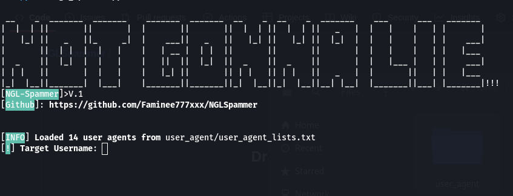

## (README English)
# NGLSpammer
# 📩 NGL Spammer Tool (Version 1)

A Python script for **sending automated messages** to an NGL profile.  
Supports **multi-threading**, **proxy lists**, and **Tor network** to bypass rate limits.  
⚠ For **educational and testing purposes only**.

---

## ⚠ Disclaimer
This program is designed **only** for testing and educational use, such as:
- Learning about HTTP requests
- Understanding threading in Python
- Studying how proxies and Tor work

## Usage
Run the program
```
python ngl_spammer.py
```

## 📦 Requirements
- Python 3.x
- Install dependencies:
```
pip install requests pysocks colorama
```


## (README ภาษาไทย)
**Do not** use this to harass, spam, or attack real people without consent.  
The developer takes **no responsibility** for misuse of this tool.

# NGLSpammer
# 📩 เครื่องมือส่งข้อความอัตโนมัติ NGL (เวอร์ชัน 1)

เป็นสคริปต์ภาษา Python สำหรับ ส่งข้อความอัตโนมัติไปยังโปรไฟล์ NGL
รองรับการใช้งานแบบ หลายเธรด (multi-threading), รายการพร็อกซี (proxy lists) และ เครือข่าย Tor เพื่อช่วยเลี่ยงข้อจำกัดการส่งข้อความ (rate limits)

# วิธีใช้
รันโปรแกรมด้วยคำสั่ง
```
python ngl_spammer.py
```

# 📦 ความต้องการระบบ Python 3.x
ติดตั้งไลบรารีที่จำเป็น:
```
pip install requests pysocks colorama
```

# ห้ามใช้โปรแกรมนี้เพื่อรบกวน, ส่งสแปมหรือโจมตีผู้อื่นโดยไม่ได้รับอนุญาต
ผู้พัฒนาไม่รับผิดชอบต่อการใช้งานในทางที่ผิดใด ๆ ทั้งสิ้น
